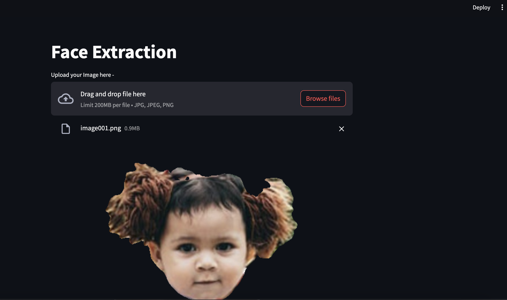

### Face Extraction and Matting
The application is made to take in an image that will have have human face in it and then extract only the face and hair region and have a transparent image that shows only the face and hair part of the image. If the image has 0 or more than 1 face the application gives out error message.

### Models Used
The application uses 2 models to complete the task. 
The job of the first model is to detect faces in the image . This Face Detector model will detect faces in the image and give out the location with the confidence score. If the number of faces in the image is 1 we move further.
The second model ,Face Parser model takes in the location of the face detected as well as the original image and gives out a segmentation mask for different features in the face (Nose , eyes , hair etc) For our use case we need all these features in the output image so I set the mask to 255 wherever features are detected.
Finally we get a new image that has 4 channels .The alpha channel has the mask for the hair and face region and thus we get the final transparent image that is displayed .


### Docker & Environment

Run the commands to use docker - 
```shell
docker build -t my-streamlit-app docker
docker run -it -v /path/to/app:/path/to/app --gpus all -p 8501:8501 my-streamlit-app
```

You can also use conda or other python environment and install the required libraries with -
```shell
pip install -r requirements.txt
```

### How to run
Once you have the environment ready , run this to start hosting of app -
```shell
streamlit run app.py
```

### Demo Sample
